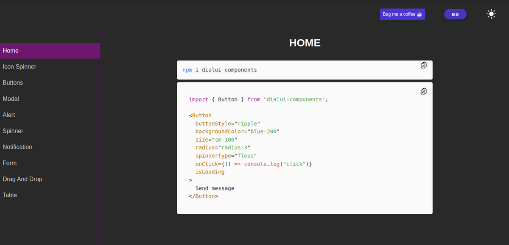

# dialui-components

mini set of react componentes

Install: `npm i dialui-components`



## user Interface Components

- [Alert](https://dialui-components.netlify.app/alert)
- [Button](https://dialui-components.netlify.app/buttons)
- [Icon spinner](https://dialui-components.netlify.app/icon-spinner)
- [Modal ](https://dialui-components.netlify.app/modal)
- [Notification](https://dialui-components.netlify.app/notificacion)
- [Spinner](https://dialui-components.netlify.app/spinner)
- [Table](https://dialui-components.netlify.app/table)

## Form Components

- [Checkbox](https://dialui-components.netlify.app/checkbox)
- [Input](https://dialui-components.netlify.app/input)
- [Input tags](https://dialui-components.netlify.app/input-tags)
- [Select and Multi Select](https://dialui-components.netlify.app/select)
- [TextArea](https://dialui-components.netlify.app/textarea)

visit npm: [npm package dialui-components](https://www.npmjs.com/package/dialui-components). For more info about documentation visit: [dialui-components](https://dialui-components.netlify.app)

### UI Components

### Alert:

Function that opens alert in lazy mode

```tsx
import {openAlert} from "dialui-components"

openAlert({
  message: typeMessage,
  type: typeError,
  sideX?: "right",
  sideY?: "down",
  duration?: 4000,
});
```

more details: [Alert](https://dialui-components.netlify.app/alert)

### Buttons:

Button component with many colors and animation styles

```tsx
import {Button} from "dialui-components"

<Button
  buttonStyle="ripple"
  backgroundColor="blue-200"
  size="sm-100"
  borderRadius="r-3"
  spinner="fleas"
  onClick={() => console.log("click")}
  isLoading
>
  Send message
</Button>
```

more details: [Button](https://dialui-components.netlify.app/buttons)

### Modal:

Function that opens modal in lazy mode

```tsx
import {openModal} from "dialui-components

openModal({
  animation: "jumpToDown",
  description: "Are you sure?",
  title: "Delete user",
  type: "info",
});
```

more details: [Modal ](https://dialui-components.netlify.app/modal)

### Notification:

```tsx
import { Notification } from "dialui-components/";

const notification = 3;

<Notification
  hasNotification={totalNotifications > 0}
  size="sm"
  backgroundColor="blue-500"
>
  {totalNotifications === 0 ? "+99" : totalNotifications.toString()}
</Notification>;
```

more details: [Notification](https://dialui-components.netlify.app/notificacion)

### Table:

```tsx
import {Table, TableHead, TableBody, Cell, Row, Title, } from "dialui-components/";

<Table>
  <TableHead>
    <Row backgroundColor={backgroundColor}>
      <Title>id</Title>
    </Row>
  </TableHead>
  <TableBody>
    {data.map((person) => (
      <Row backgroundColor={backgroundColor} key={person.id}>
        <Cell>{person.id}</Cell>
        <Cell>
          <Button
            buttonStyle="table"
            backgroundColor="blue-600"
            textTransform="uppercase"
          >
            edit
          </Button>
        </Cell>
      </Row>
    ))}
  </TableBody>
</Table>;
```

More details: [Table](https://dialui-components.netlify.app/table)

### Spinner:

```tsx
import {openAlert} from "dialui-components"

<Spinner spinnerType="squares" />
```

More details: [Spinner](https://dialui-components.netlify.app/spinner)

visit the complete documentation at: [dialui-components](https://dialui-components.netlify.app)
